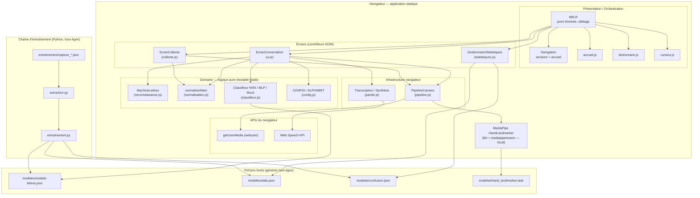
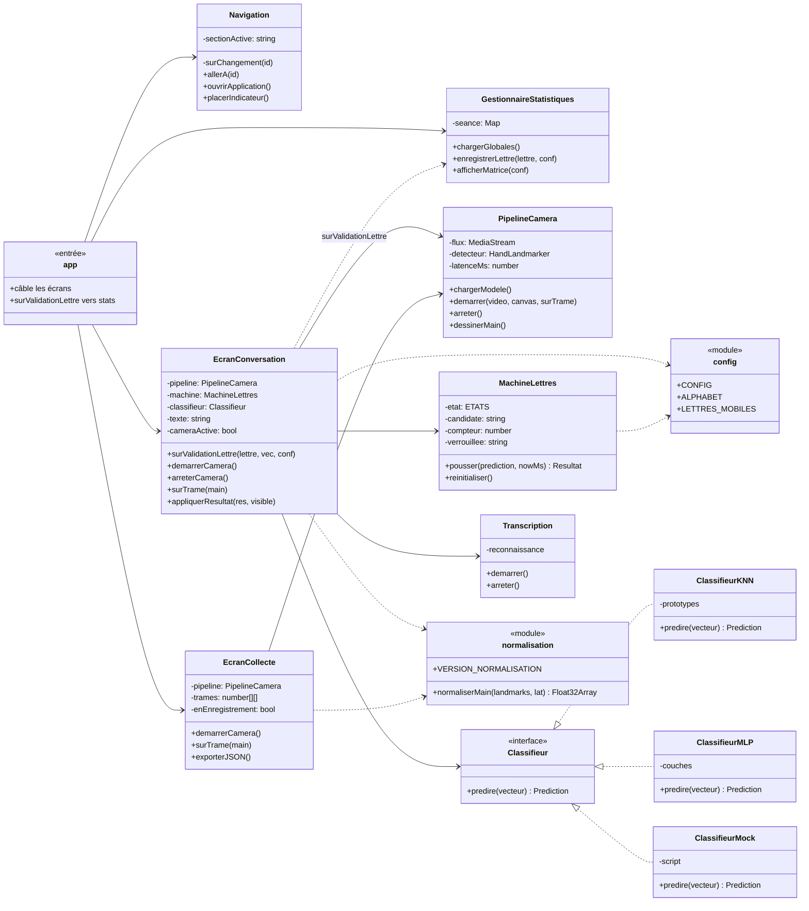

# DoigtsBavards / Épelle — Architecture

## 1. Vue en couches (composants)

L'app est **statique** (servie par `python -m http.server`), **sans build**, et **hors-ligne** :
runtime WASM et modèles auto-hébergés, aucun appel réseau tiers.



---

## 2. Diagramme de classes (modules JS)



### Principes d'architecture à mettre en avant

- **Couche domaine pure et testable** : `MachineLettres`, `normaliserMain`, les classifieurs n'ont
  **aucune dépendance navigateur** → testables avec Node (`scripts/demo-saisie.mjs`,
  `entrainement/test_coherence.py`).
- **Polymorphisme par contrat** : KNN / MLP / Mock partagent la même méthode `predire(vecteur)` ;
  l'UI ignore lequel tourne (repli automatique sur Mock si pas de modèle).
- **Cohérence Python ↔ JS garantie** : même normalisation (`main-63d-v2`) et même règle de confiance
  (`1 − d1/d2`), avec un **garde-fou de version** qui refuse un modèle incompatible.
- **Vie privée par conception** : caméra sur clic uniquement, jamais le micro avec, aucun pixel stocké
  ni transmis, pistes vidéo coupées au changement de section.
```
