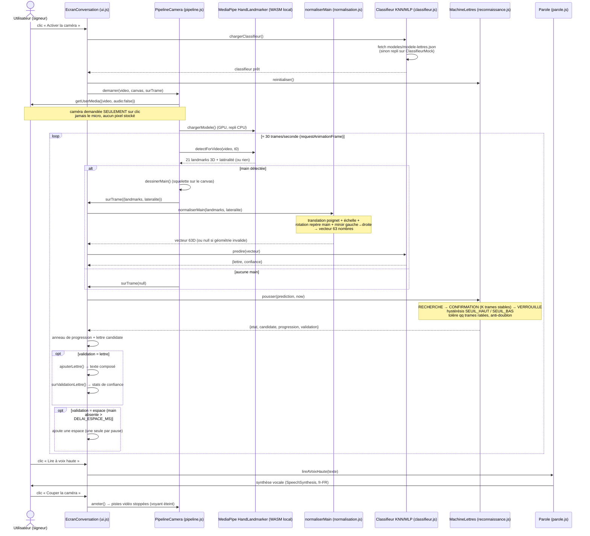
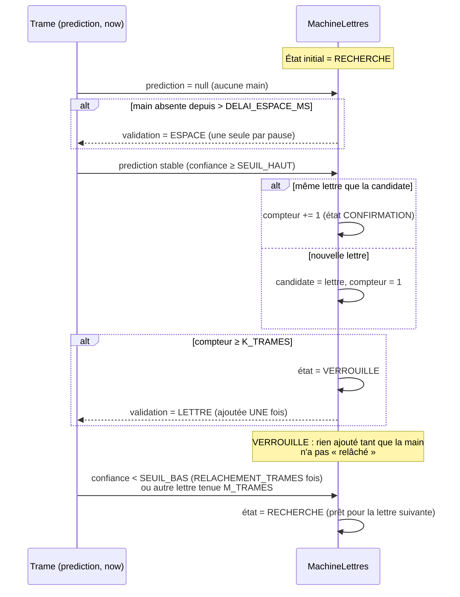
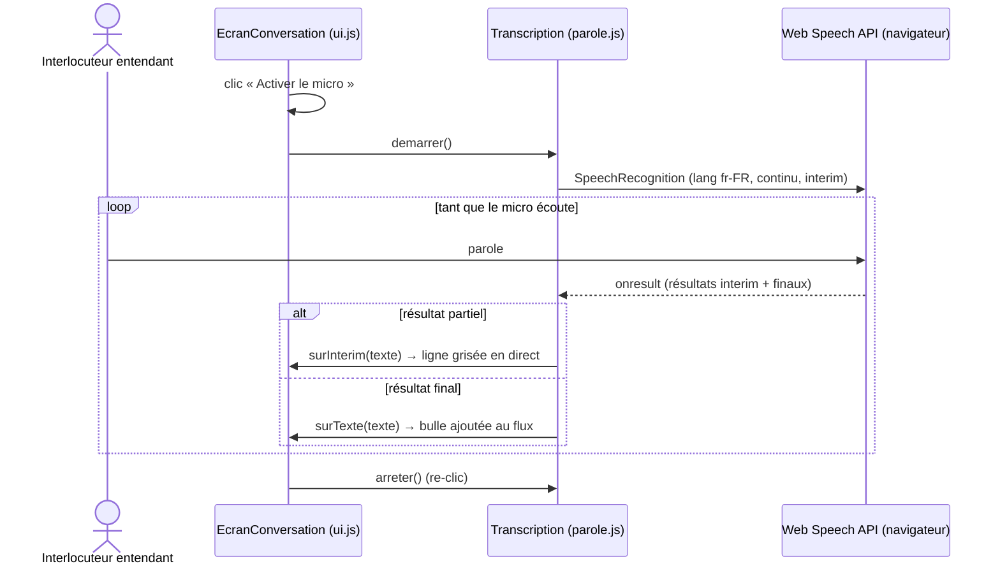
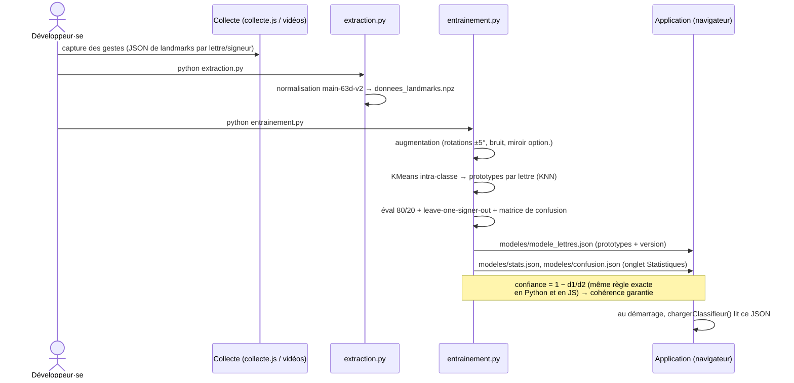

# DoigtsBavards / Épelle — Diagrammes de séquence

Application web **100 % locale** (HTML/CSS/JS pur, aucune étape de build, aucun serveur tiers)
de reconnaissance de la **dactylologie LSF** (alphabet signé). Deux sens de communication :

- **Sourd·e → entendant·e** : la webcam lit les signes → texte → synthèse vocale.
- **Entendant·e → sourd·e** : le micro écoute la parole → texte (transcription).

Plus une **chaîne d'entraînement hors-ligne** (Python) qui produit le modèle chargé par le navigateur.

---

## 1. Reconnaissance d'une lettre (flux principal : signe → texte → voix)

C'est le cœur de l'application. La boucle tourne ≈ 30 fois/seconde ; la **machine à états**
garantit qu'**une seule lettre est ajoutée par geste volontaire** (sinon la lettre détectée
serait écrite 30 fois/seconde).



### Détail de la machine à états (`MachineLettres.pousser`)



---

## 2. Transcription parole → texte (entendant·e → sourd·e)



---

## 3. Chaîne d'entraînement hors-ligne (produit le modèle)

Exécutée **une fois** en Python par les développeurs ; le navigateur ne fait que **charger**
le `modele-lettres.json` résultant. La même convention de normalisation
(`VERSION_NORMALISATION = main-63d-v2`) est partagée entre Python et JS — un garde-fou
refuse un modèle entraîné avec une autre convention.



---

## Composants clés (récapitulatif)

| Fichier | Rôle |
|---|---|
| `js/pipeline.js` | Webcam + MediaPipe → 21 landmarks 3D par trame |
| `js/normalisation.js` | Landmarks → vecteur 63D invariant (position/échelle/rotation/main) |
| `js/classifieur.js` | Vecteur → `{lettre, confiance}` (KNN, MLP ou Mock) |
| `js/reconnaissance.js` | Machine à états : 1 lettre par geste volontaire |
| `js/ui.js` | Orchestration écran Conversation + transcription |
| `js/parole.js` | Parole→texte (reconnaissance) et texte→parole (synthèse) |
| `js/config.js` | Tous les seuils réglables (SEUIL_HAUT/BAS, K_TRAMES, etc.) |
| `entrainement/*.py` | Chaîne hors-ligne produisant le modèle JSON |
```
